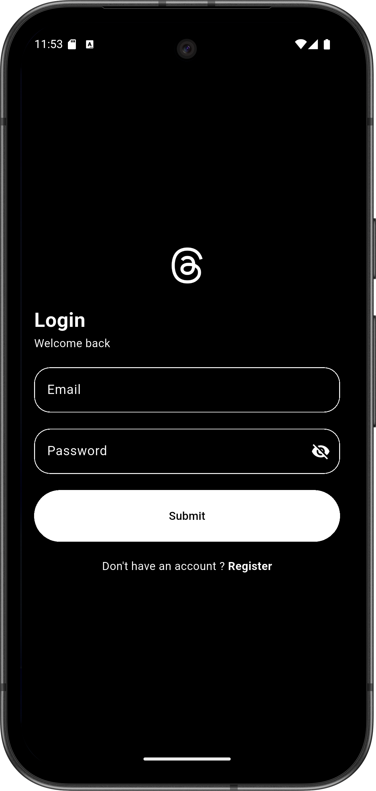
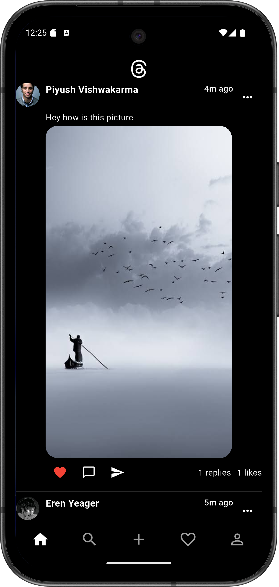
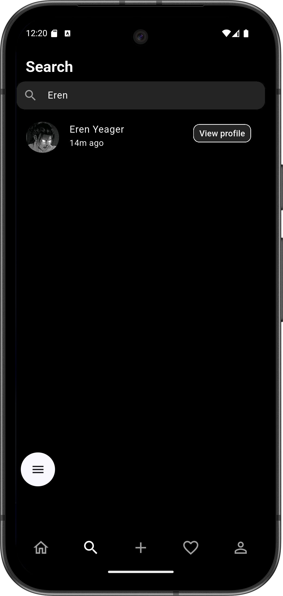
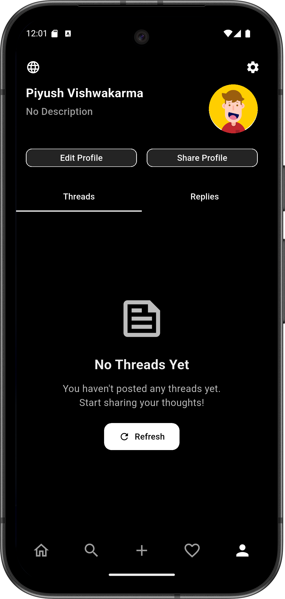
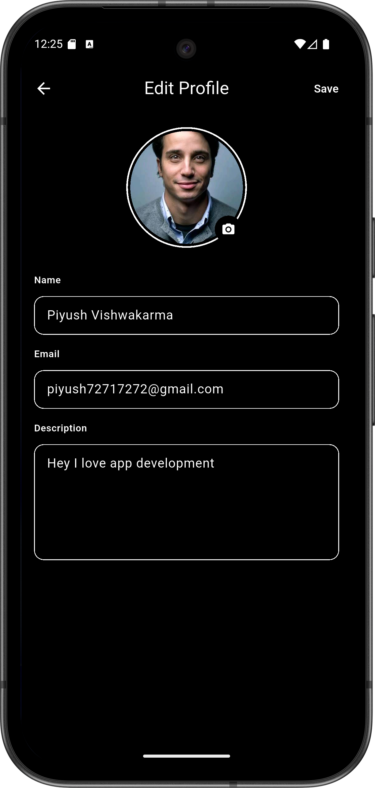
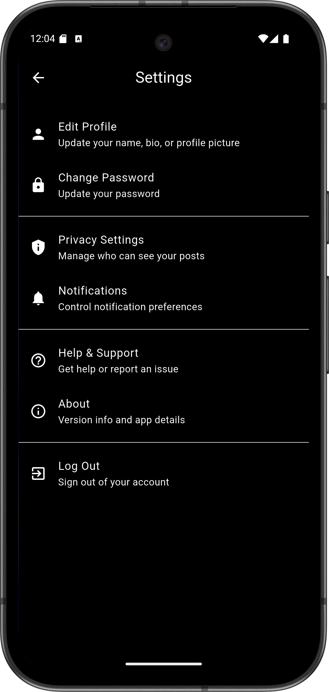
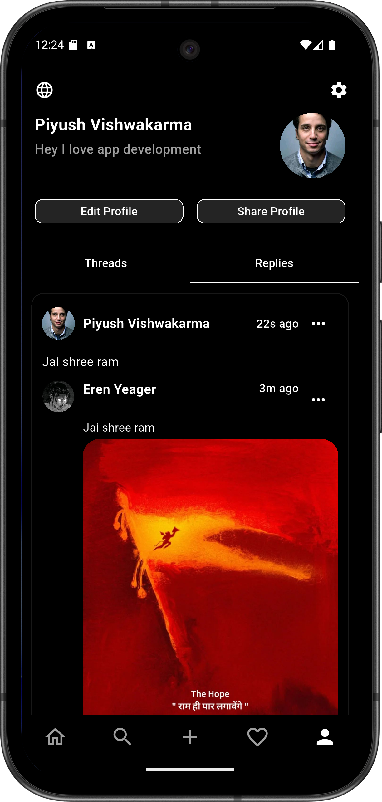
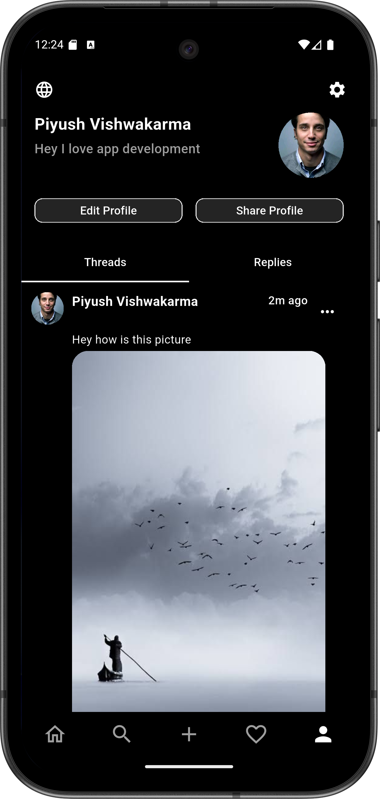
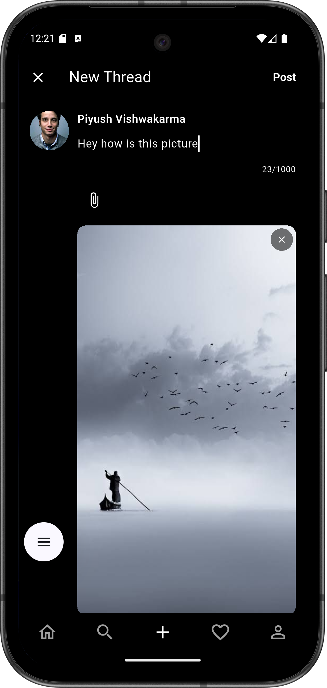
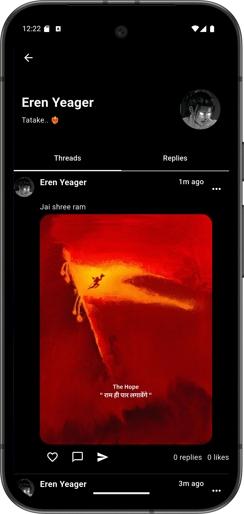

# Threads Clone

A modern **Thread-based social app** built with **Flutter**, leveraging **Supabase** for backend
services and following **MVC + Clean Architecture** principles.
The app supports authentication, posting threads, commenting, liking, notifications (stored in-app),
profile management, and media uploads.

---

## 📱 Features

### Authentication & User Management

* Email/password authentication using Supabase.
* Register, Login, Change Password.
* Persistent login with **GetStorage**.
* Edit profile: update name, avatar image.
* Soft delete user account.

### Threads & Comments

* Create, read, update, delete threads (CRUD).
* Upload images with threads.
* View your threads and replies.
* Reply to threads and comments.
* Like threads.

### Search & Social Interaction

* Search users by name.
* View public profiles.
* Notifications stored in-app (not FCM):

    * Mentions
    * Replies
    * Likes
    * Follows
    * Messages
    * Trending
    * Reminders
    * System notifications

### UI & UX

* Clean **Material3 Dark Theme**.
* Bottom navigation for Home, Search, Create Thread, Notifications, Profile.
* Shimmer effects for loading states.
* Image picker with camera/gallery.
* Image compression for uploads.
* Refreshable lists with custom indicators.

### Architecture & Tools

* MVC + Clean Architecture.
* Dependency Injection with **GetX**.
* State management: **GetX Observables**.
* Supabase backend (database, auth, storage).
* Environment variables via `flutter_dotenv`.

---

## ⚡ Dependencies

```yaml
dependencies:
  flutter:
    sdk: flutter

  # State management & storage
  get: ^4.7.3
  get_storage: ^2.1.1

  # Networking & backend
  supabase_flutter: ^2.12.0
  share_plus: ^12.0.1
  flutter_dotenv: ^6.0.0

  # Utilities
  uuid: ^4.5.2
  jiffy: ^6.4.4
  form_validator: ^2.1.1

  # Images & media
  image_picker: ^1.2.1
  flutter_image_compress: ^2.4.0
  extended_image: ^10.0.1

  # UI Enhancements
  shimmer: ^3.0.0
  custom_refresh_indicator: ^4.0.1
```

---

## 🖼 Screenshots

> All screenshots are stored in `assets/screenshots/` folder.

| Screen        | Screenshot                                            |
|---------------|-------------------------------------------------------|
| Login         |                 |
| Register      |           |
| Home          |                   |
| Search        |               |
| Notifications |  |
| Profile       |             |
| Edit Profile  |   |
| Settings      |           |
| Thread View   |          |
| My Replies    |       |
| My Threads    |       |
| Create Thread | |
| View Profile  |   |

---

## 🚀 Installation

1. Clone the repo:

```bash
git clone https://github.com/piro-piyush/threads_clone.git
cd threads_clone
```

2. Install dependencies:

```bash
flutter pub get
```

3. Create a `.env` file with Supabase URL and Key:

```ini
SUPABASE_URL=<your-supabase-url>
SUPABASE_KEY=<your-supabase-anon-key>
S3_BUCKET=<your-bucket-name>
```

4. Run the app:

```bash
flutter run
```

---

## 📂 Folder Structure

```
lib/
├─ bindings/         # GetX bindings
├─ controllers/      # GetX controllers
├─ models/           # Data models
├─ routes/           # Named routes
├─ services/         # API & Supabase services
├─ utils/            # Helpers, Enums, Mixins
├─ views/            # UI screens
├─ widgets/          # Reusable widgets
└─ main.dart         # Entry point
```

---

## 🗑 License

MIT License
